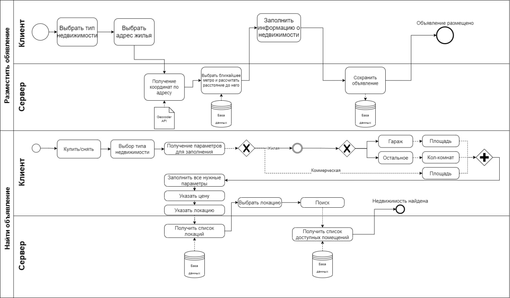
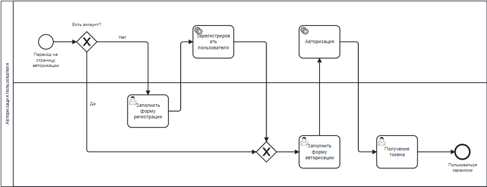
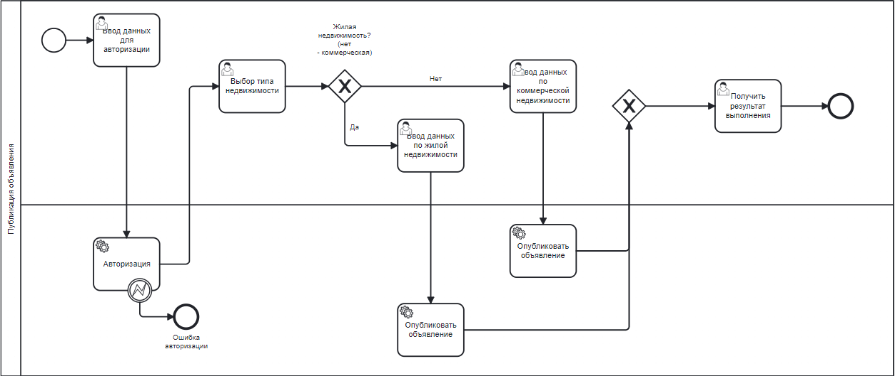
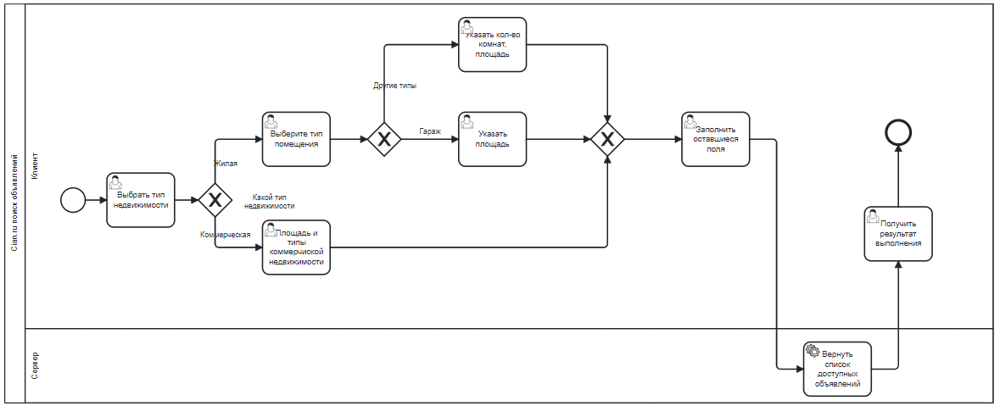
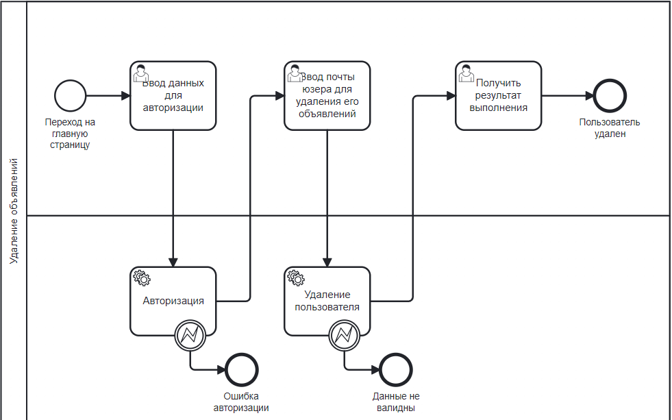
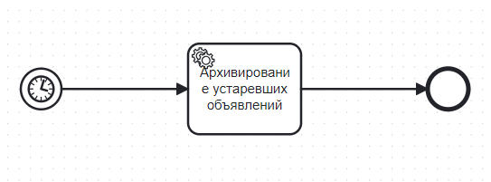

Над проектом работали:
* [Андрей Васильев](https://github.com/wizarsi)
* [Максим Васильев](https://github.com/bball30)

BMPN диаграмма разработанных бизнес процессов

1 этап:

Была разработана бизнес логика в соответствии BMPN диаграммой

2 этап:

* Управление транзакциями с помощью Spring JTA
* Авторизация Spring Security + JAAS(access + refresh JWT token)

3 этап:

Асинхронный обмен сообщениями между сервисами Apache Kafka + ZooKeeper. В проекте 3 основных сервиса и все общаются по Kafka.
*   Geocoder сервис, отправляет запросы к Yandex API для получения координат по адресу. Используются Retryable.
*   Mail сервис, служит для уведомления пользователей по их почте. Это происходит при всяких обновлениях в их объвлениях.
*   Ad сервис, поиск и добавление объявлений. 

Планировщика задач Spring (@Scheduled). Eжедневно сron запускается архивирование объявлений, у которых время жизни достигло 30 дней.

4 этап:

Релизация находится в ветке проекта camunda. 

Для управления бизнес-процессом в веб-приложение был встроен BPM-движок Camunda. 
Пользовательский интерфейс приложения создан с помощью генератора форм.

Бизнесс процессы добавленные в Camunda:

